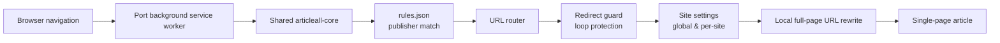

# Articleall

> **Read Indonesian news in one page.**  
> *Baca berita Indonesia dalam satu halaman.*

[](https://developer.chrome.com/docs/extensions/develop/migrate/what-is-mv3)
[](https://github.com/articleall/articleall-core/blob/master/PRIVACY.md)
[](https://opensource.org/licenses/MIT)

Articleall is a privacy-first browser extension for Indonesian readers. It automatically turns multi-page news articles into a full-page, single-page reading experience by rewriting navigation URLs locally in your browser.

## What is Articleall?

Many Indonesian news sites split one article across several pages. Articleall recognizes supported article URLs and opens the full-page version when one exists—without a proxy, account, analytics, or remote service. It works quietly in the browser, with controls for readers who want to enable or disable it globally or per publisher.

## Features

- Supports **31 Indonesian publishers**, with rules maintained in a shared core.
- Rewrites top-level navigation URLs locally; article content never passes through Articleall.
- Per-site toggles plus a global on/off switch.
- `Alt+Shift+A` keyboard shortcut for quickly toggling Articleall.
- Article-path filtering to avoid changing non-article pages.
- Redirect-loop protection and safe fallback behavior.
- Bilingual interface: English and Indonesian.
- Sync storage with a local-storage fallback.
- One shared implementation across Chrome, Firefox, and Safari ports.
- Vanilla JavaScript ES modules, Manifest V3, no bundler, and automated tests.

## Supported browsers

| Browser | Version | Extension | Status |
| --- | --- | --- | --- |
| Chrome | Manifest V3, v1.1.0 | [articleall-chrome](https://github.com/articleall/articleall-chrome) | Manual install from source |
| Firefox | Manifest V3, v1.1.0 | [articleall-firefox](https://github.com/articleall/articleall-firefox) | Manual install from source |
| Safari | Safari Web Extension | [articleall-safari](https://github.com/articleall/articleall-safari) | macOS/Xcode scaffold; store release coming later |

> Store download links are not published yet. Until then, use the source repositories and the browser developer-mode installation instructions.

## Repository map

| Repository | Purpose |
| --- | --- |
| [articleall-core](https://github.com/articleall/articleall-core) | Shared monorepo containing the URL router, `rules.json` for 31 publishers, sync script, tests, CI, ESLint, documentation (`PRIVACY.md`, `CHANGELOG`, `STORE.md`), and options UI templates |
| [articleall-chrome](https://github.com/articleall/articleall-chrome) | Chrome Manifest V3 extension, version 1.1.0 |
| [articleall-firefox](https://github.com/articleall/articleall-firefox) | Firefox Manifest V3 extension, version 1.1.0; Gecko ID `articleall@faiz.at` |
| [articleall-safari](https://github.com/articleall/articleall-safari) | Safari Web Extension and macOS/Xcode scaffold |

## Architecture



Each browser port delegates matching and redirect decisions to the shared core. The final URL rewrite happens locally before the destination page loads; Articleall does not fetch, store, or transmit article data.

## Supported publishers

Articleall currently includes rules for these 31 domains:

| | Publishers | | Publishers | | Publishers |
| --- | --- | --- | --- | --- | --- |
| 1 | [Kompas](https://www.kompas.com) | 12 | [Kompasiana](https://www.kompasiana.com) | 23 | [CNN Indonesia](https://www.cnnindonesia.com) |
| 2 | [Suara](https://www.suara.com) | 13 | [IDN Times](https://www.idntimes.com) | 24 | [Okezone](https://www.okezone.com) |
| 3 | [Tribunnews](https://www.tribunnews.com) | 14 | [Popmama](https://www.popmama.com) | 25 | [Antara News](https://www.antaranews.com) |
| 4 | [Grid](https://www.grid.id) | 15 | [Kosadata](https://www.kosadata.com) | 26 | [Republika](https://www.republika.co.id) |
| 5 | [Viva](https://www.viva.co.id) | 16 | [Fajar](https://www.fajar.co.id) | 27 | [Bisnis](https://www.bisnis.com) |
| 6 | [Intipseleb](https://www.intipseleb.com) | 17 | [Sindonews](https://www.sindonews.com) | 28 | [Jawa Pos](https://www.jawapos.com) |
| 7 | [Parapuan](https://www.parapuan.co) | 18 | [Poskota](https://www.poskota.co.id) | 29 | [BeritaSatu](https://www.beritasatu.com) |
| 8 | [Sonora](https://www.sonora.id) | 19 | [Detik](https://www.detik.com) | 30 | [iNews](https://www.inews.id) |
| 9 | [Herstory](https://www.herstory.co.id) | 20 | [Insidermonkey](https://insidermonkey.com) | 31 | [Wahana News](https://www.wahananews.co) |
| 10 | [Motorplus](https://www.motorplus-online.com) | 21 | [Merdeka](https://www.merdeka.com) | | |
| 11 | [Liputan6](https://www.liputan6.com) | 22 | [Tempo](https://www.tempo.co) | | |

> Publisher coverage is defined by the shared `rules.json`; names and URL patterns may evolve as sites change. See [articleall-core](https://github.com/articleall/articleall-core) for the authoritative rule set.

## Privacy

**Articleall is local-only by design.**

- No analytics, telemetry, tracking pixels, or user profiling.
- No data collection and no remote servers.
- No article content or browsing history is sent to Articleall.
- URL matching, settings, and redirects run in the browser.
- Settings use browser sync storage when available, with a local fallback.

For the implementation details and policy, read [`PRIVACY.md` in articleall-core](https://github.com/articleall/articleall-core/blob/master/PRIVACY.md).

## Getting started

Clone the repositories side by side in one workspace:

```text
articleall/
├── articleall-core/
├── articleall-chrome/
├── articleall-firefox/
└── articleall-safari/
```

Set up and test the shared core:

```bash
git clone https://github.com/articleall/articleall-core
cd articleall-core
npm install
npm run test:all
```

To try an extension, run the core sync task, then load the relevant port directory as an unpacked/temporary extension using the browser's developer tools:

```bash
npm run sync
```

Chrome and Firefox can be loaded from their respective extension repositories. Safari development uses the macOS/Xcode scaffold in `articleall-safari`. Follow each repository's README for browser-specific signing and packaging steps.

## Contributing

Contributions are welcome. To add or update a publisher:

1. Add the matching and full-page URL behavior to `rules.json` in [articleall-core](https://github.com/articleall/articleall-core).
2. Run `npm run sync` so each browser port receives the shared core.
3. Add or update the rule's test cases, then run `npm run test:all` and the repository lint checks.
4. Open an issue or pull request with the publisher, example article URLs, and the expected rewrite.

Please avoid including private browsing data in reports. Start with the [core issues](https://github.com/articleall/articleall-core/issues), or open an issue in the relevant browser-port repository.

## License

Articleall is released under the [MIT License](https://github.com/articleall/articleall-core/blob/master/LICENSE).

## Contact

- Report bugs and request publishers through [GitHub Issues](https://github.com/articleall/articleall-core/issues).
- Browse the [Articleall organization](https://github.com/articleall) and its repositories.
- For project documentation and privacy questions, see [articleall-core](https://github.com/articleall/articleall-core).

<!-- Future brand assets can be added under profile/assets/ without changing the content structure. -->
